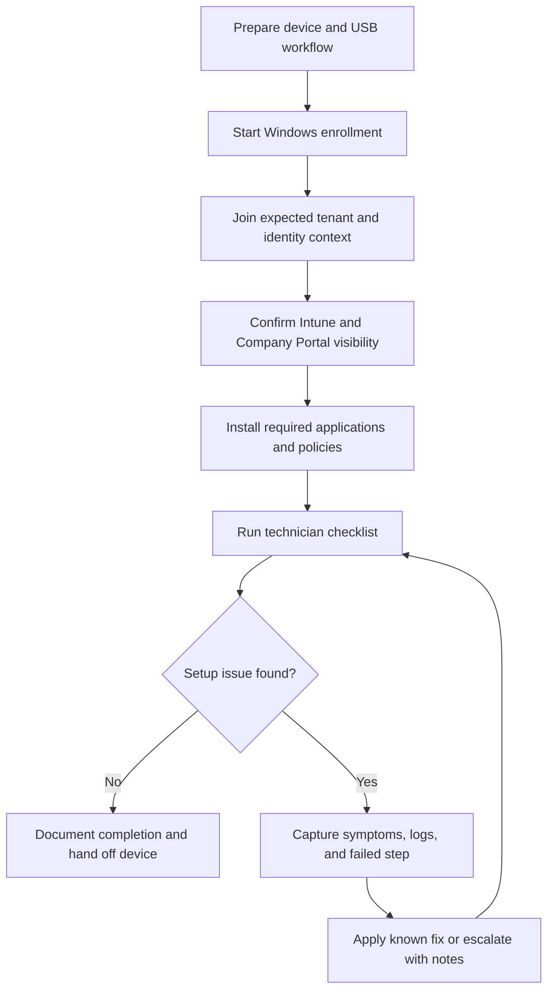

# Endpoint Autopilot Workflow Case Study

[Back to project index](index.md)

## Summary

Endpoint-support case study based on professional Microsoft endpoint work. It shows operational thinking, documentation discipline, and troubleshooting structure.

## Problem

Endpoint setup can become inconsistent when technicians must remember manual setup steps, deployment order, tenant-specific details, application installs, and troubleshooting checks under time pressure. A repeatable workflow makes device setup easier to follow, easier to support, and easier to escalate when something breaks.

## Technical Highlights

- Microsoft endpoint support context involving Windows endpoints, Microsoft Intune, Windows Autopilot, Company Portal, Microsoft 365, and Entra ID / Azure AD exposure.
- Script-assisted setup workflow intended to make enrollment steps more repeatable.
- Documentation-first approach so other technicians can follow the process.
- Troubleshooting focus around application deployment, access, setup consistency, and escalation clarity.
- Translation of professional support work into reusable engineering/process evidence.

## Generalized Workflow

## Technician Checklist

- Confirm the device is expected to be enrolled and assigned correctly.
- Start the enrollment workflow from a known-good preparation state.
- Verify the user, tenant, and device-management context before assuming an app issue.
- Check Company Portal and required app deployment status.
- Record the exact failed step, visible error, retry behavior, and any workaround used.
- Hand off unresolved issues with enough detail for infrastructure or security teams to act.

## Troubleshooting Matrix

| Symptom area | Check |
| --- | --- |
| Enrollment does not complete | Confirm assignment, network access, and management-service visibility. |
| Required app does not install | Check deployment targeting, Company Portal status, and install retry behavior. |
| User cannot access expected resources | Verify identity, group membership, licensing, and conditional-access context. |
| Setup differs between technicians | Compare against the documented checklist and update the repeatable workflow. |

## What This Demonstrates

- Endpoint support and provisioning workflow thinking
- Microsoft endpoint-management exposure
- Process improvement
- Technician-facing documentation
- Practical support automation
- Escalation-friendly troubleshooting
- Careful documentation of support workflows

## Role Relevance

This case study supports endpoint support, technical support engineer, junior systems administration, implementation, and developer-support applications. It also reinforces a broader engineering trait: turning ambiguous operational failure modes into repeatable checks and supportable documentation.
